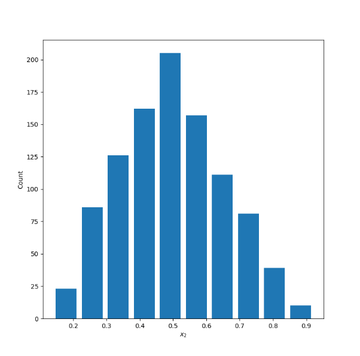
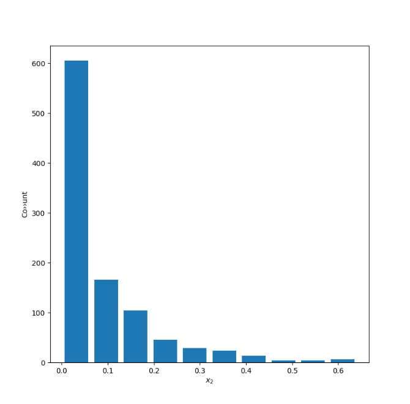
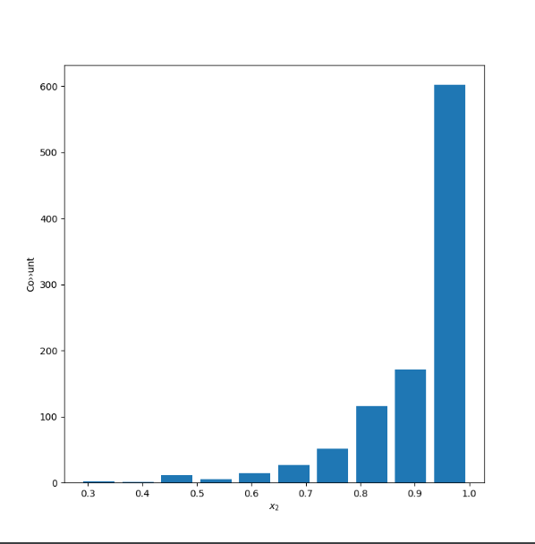
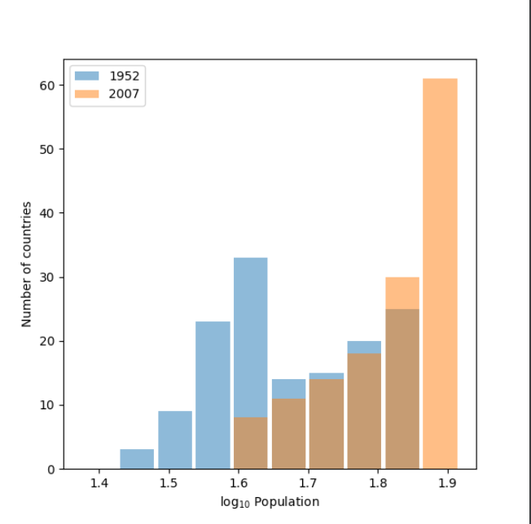
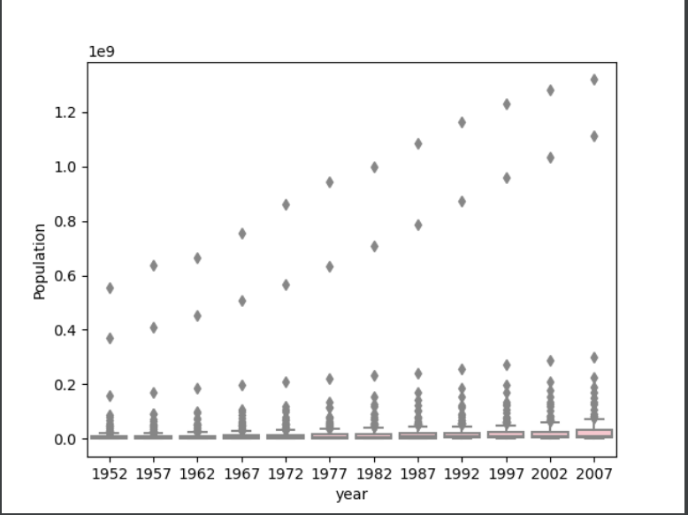
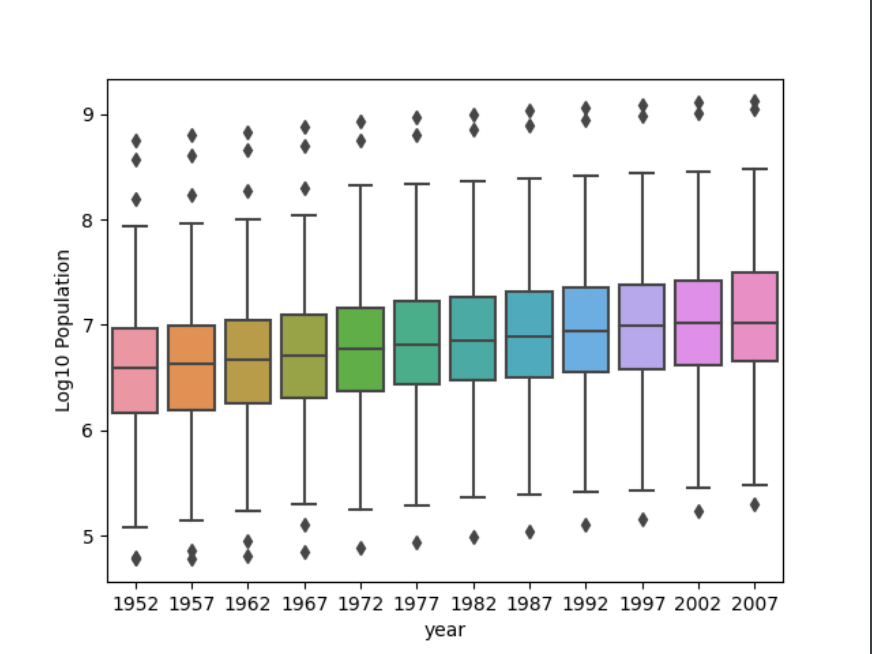

# Project 2

## Question 1

Continuous data is numerical data that provides quantitative information about a variable. Continuous data can be further broken down into interval and ratio variables. Interval variables are measured along a continuum where 0 is just another number along the continuum (ex. temperature in celsius). Ratio variables are the same as interval variables with the exception that 0 indicates there is none of that variable (ex. weight). Nominal variables are essentially categories or bins that split up the data set by some characteristic of interest (ex. parrots, songbirds, hawks). Ordinal data is similar to nominal data with the exception that the categories have a distinct order (ex. 1st, 2nd, 3rd place in a race). 

To illustrate these types of data imagine a dataset providing information about the yields of every potato farmer in Idaho. This dataset might include which types of potato each farmer chose to grow that year. Different types of potatoes are an example of nominal data. There might also be information about the weight in pounds of each farmer's yield, which would be an example of continuous data. The data set could also have subjective evaluations of the growing conditions for a given year as reported by the farmers on a scale from 1 to 5 (1 being very poor and 5 being very good). This is an example of ordinal data because the values represent a distinct rank for the growing conditions. The features might be the different types of potato and growing conditions and the targets could be the yield for each type of potato. The goal of the analysis would then to be determine if certain potato types and self reported growing conditions correlated with higher yield. 

## Question 2

The first plot uses alpha and beta of 5 with a sample of 10000 data points, which yields a relatively normal distribution with a mean of 0.4995770839499861 and a median of 0.5030168812134036.

The second plot uses alpha of 0.5 and beta of 2 to produce a right skewed distribution. The mean is 0.20507526624882796 and the median is 0.12508862540626092. The mean is more easily influenced by outliers, which explains why it is greater than the median for a skewed right distribution.

The third plot uses alpha of 5 and beta of 0.5 to produce a left skewed distribution. The mean is 0.9117711226108247 and the median is 0.9540031869608877. The mean is more easily influenced by outliers, which explains why it is smaller than the median for a skewed left distribution.

# Question 3

This first plot shows the change in life expectancy from 1952 to 2007 with the raw data. 

This plot shows the life expectancy data transformed to a logarithmic scale with base 10 using np.log10(). 

The log10 plot is more helpful in this case because it more clearly shows the trend upward in life expectancy that occurred over time. The raw data plot still conveys this information but it is  less clear because of the overlap and similar height of the bars from 1952 and 2007. The benefit of using logarithms is they can scale data on a graph such that vast discrepancies are closer together in space, which makes plots much more readable. There isn't a huge difference in the range of values for life expectancies so although I do believe the log plot is more clear, logarithms are more useful for looking at data that spans a wider range. This is illustrated in the difference between the raw and logarithmic population box and whiskers plots in question 4. The value of logarithms is shown more clearly when the smallest and greatest values differ by orders of magnitude rather than tens or hundreds. 

# Question 4

The first plot shows the box and whiskers plot for population in each year of the gapminder data set using the raw data.

This plot shows the same information but with the population variable transformed using the np.log10() method.

The log10 plot communicates the information much better than the raw data plot because the values are closer together so the outliers don't skew the scale as much. The transformation makes the plot much more readable and allows for better comparison between years. Because the boxes in the raw data plot are so small it's difficult to see the trend of increasing population over time that is evident in the log plot.
